# 💳 Financial Risk & Loan Portfolio Analysis

> **Tools:** Python · SQL (SQLite) · Power BI · Excel · Pandas · Plotly  
> **Dataset:** Give Me Some Credit — Kaggle (120,665 loan applicants)  
> **Business Question:** Which borrower profiles are most likely to default,
> and how can lenders identify high-risk applicants before loan approval?

---

> 🚀 **Live Demo:** [Open Streamlit Dashboard](YOUR_STREAMLIT_URL_HERE)

---

## 📊 Power BI Dashboard

### Overview
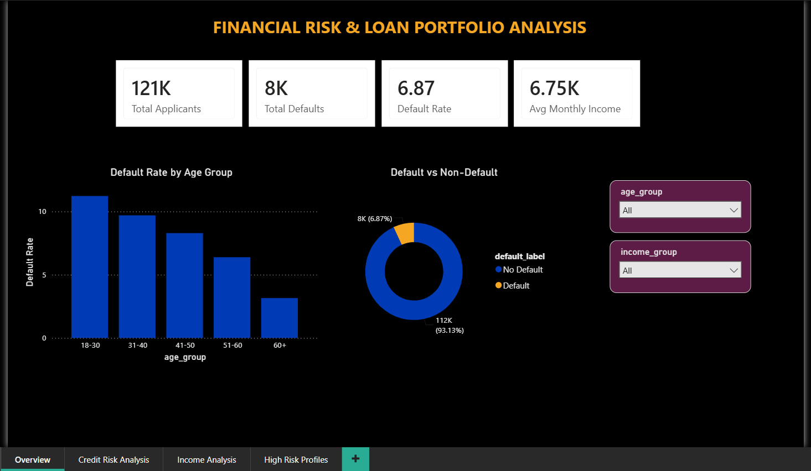

### Credit Risk Deep Dive
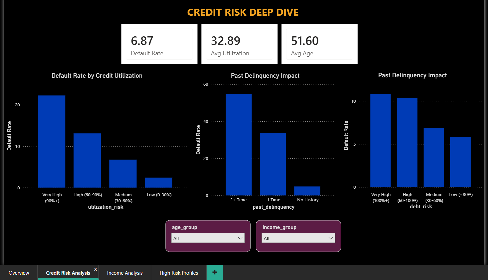

### Income & Demographic Analysis
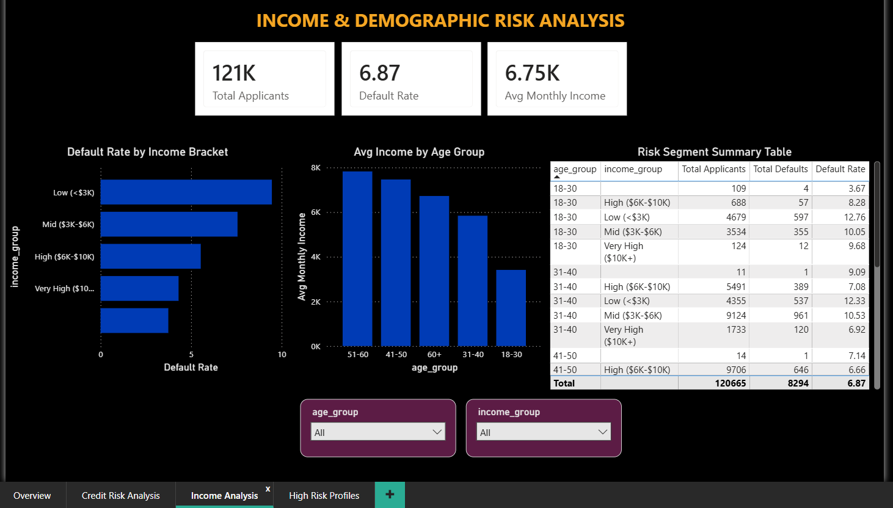

### High Risk Borrower Identification
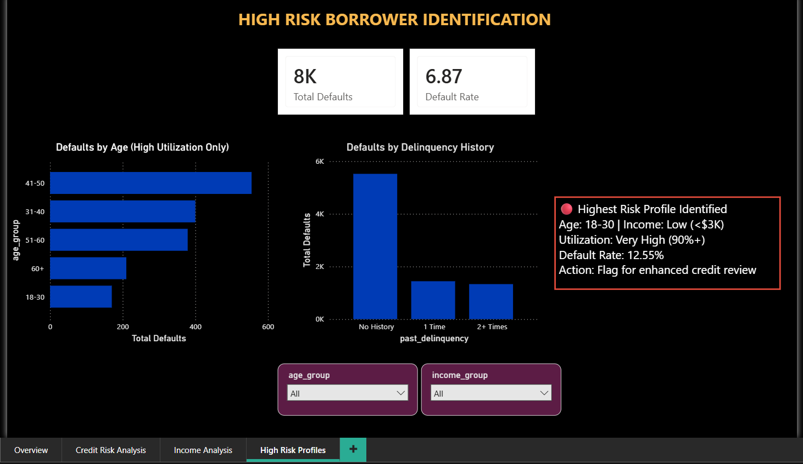

---

## 📈 Python Analysis Charts

### Chart 1 — Portfolio Overview
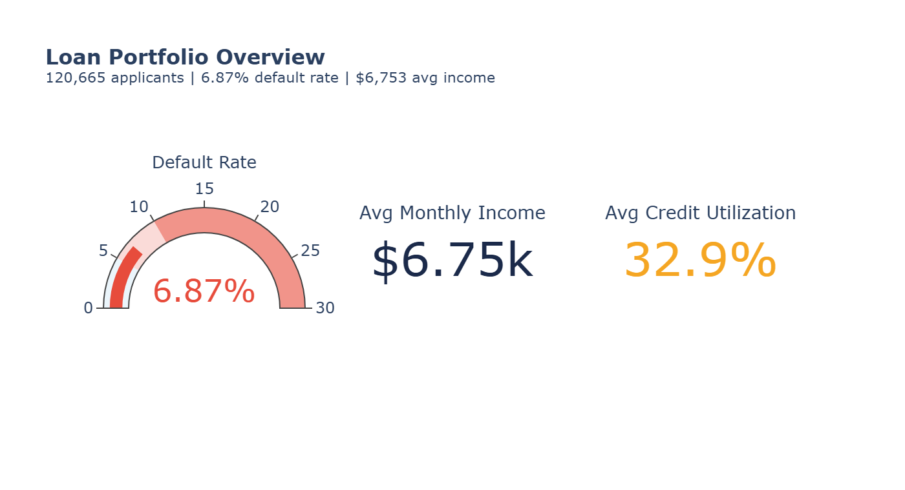

### Chart 2 — Default Rate by Age Group
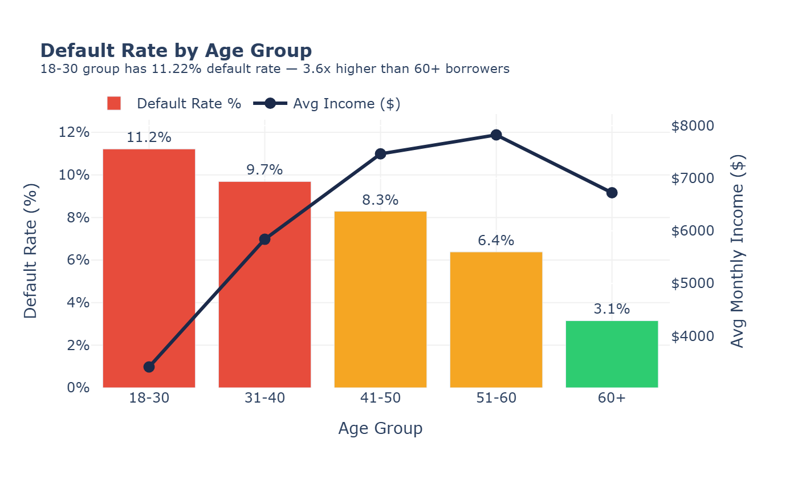

### Chart 3 — Credit Utilization vs Default Rate
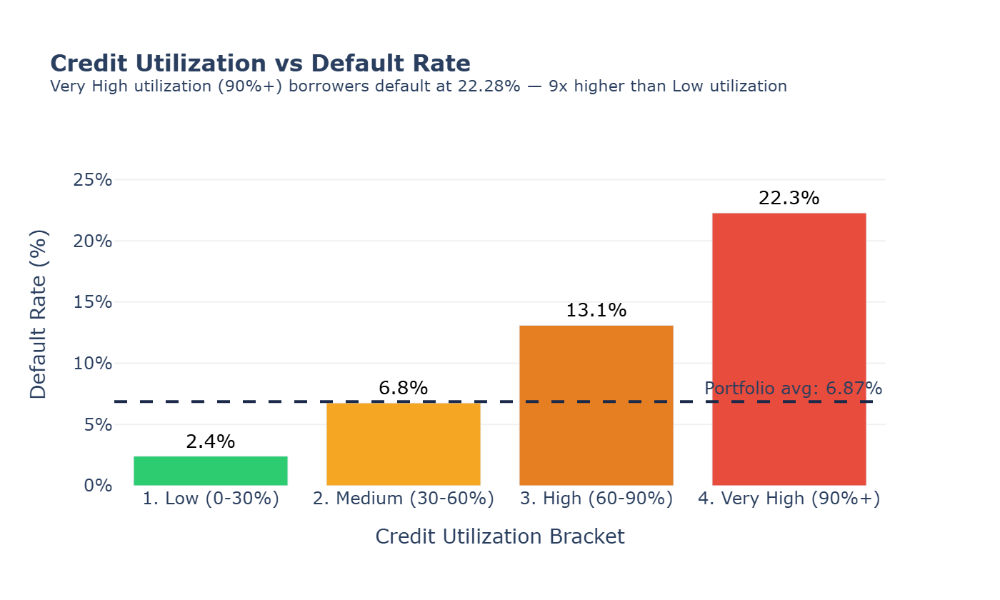

### Chart 4 — Past Delinquency Impact
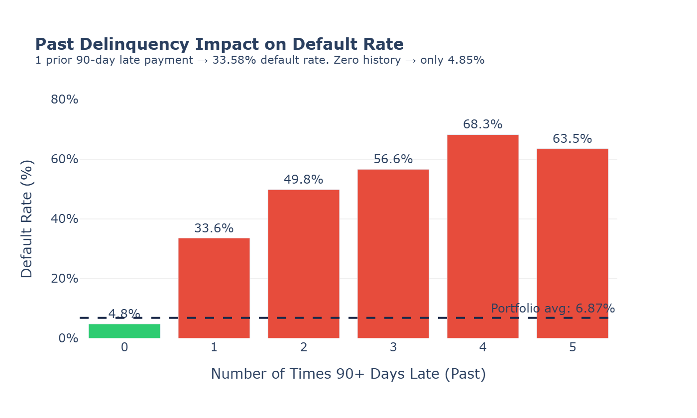

### Chart 5 — Income vs Debt Ratio Risk Matrix
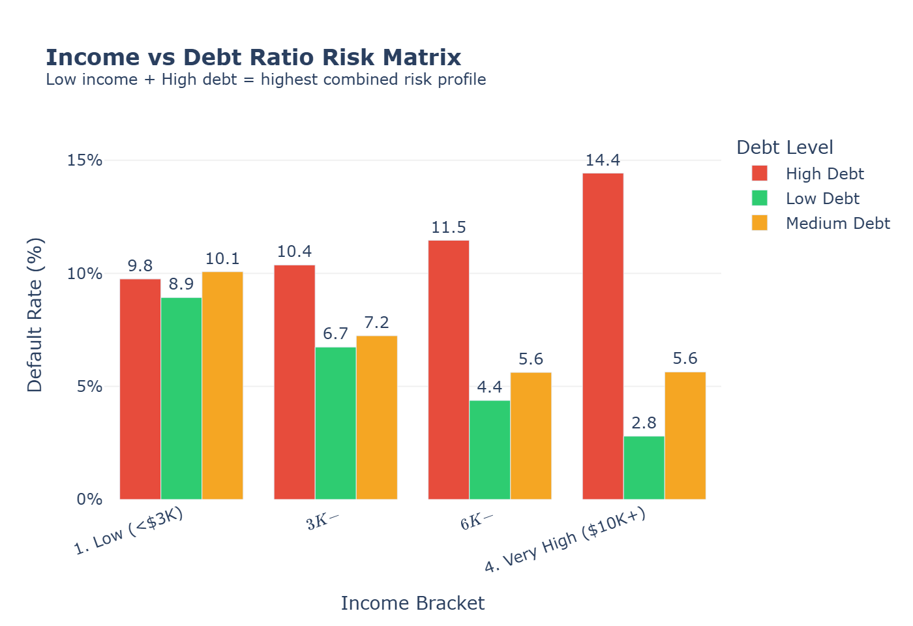

### Chart 6 — Default Rate Heatmap
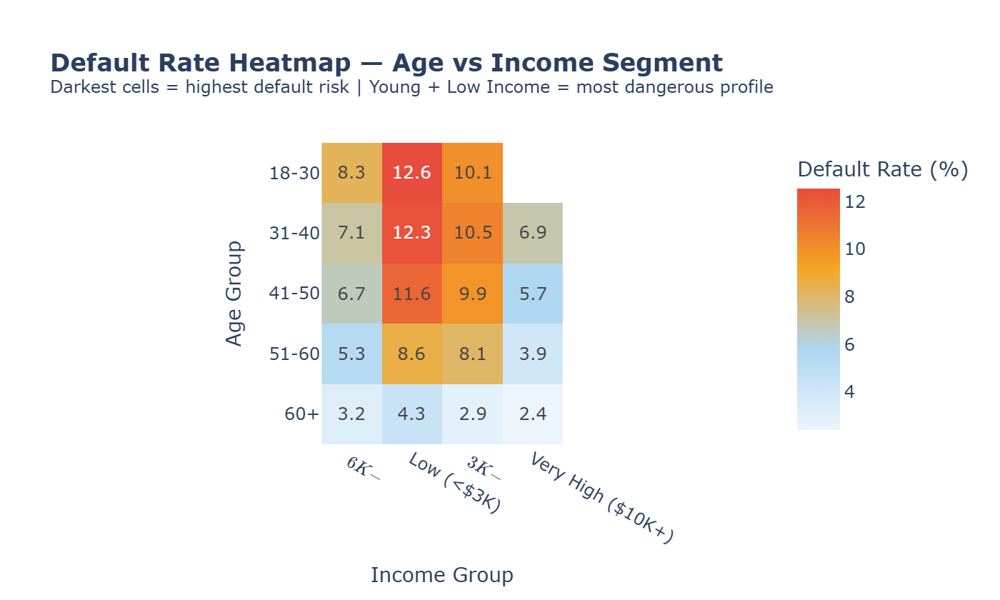

---

## 📊 Excel Analysis

### Age Group Risk Analysis
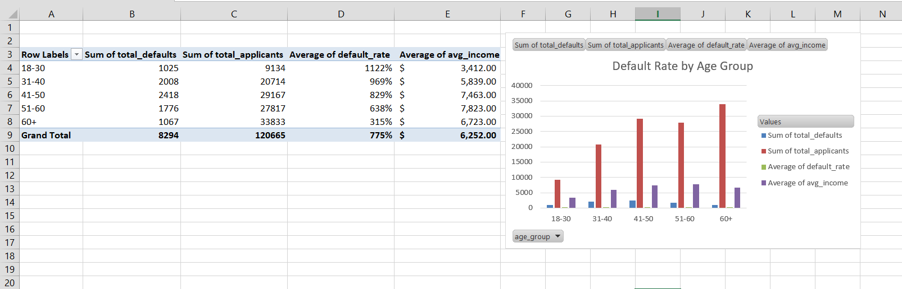

### Income vs Utilization Risk Matrix
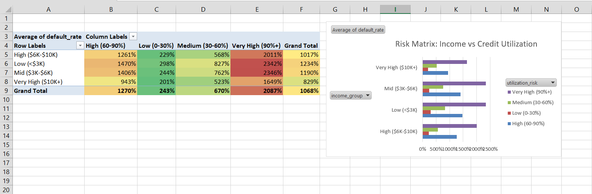

---

## 🔍 Key Business Insights

### 1. Young Borrowers Are the Highest Risk Segment
18-30 age group defaults at **11.22%** — 3.6x higher than 60+ borrowers
(3.15%). Income also plays a role: young + low income borrowers default
at **12.55%** with average credit utilization of 52.64%.

**Recommendation:** Apply stricter credit review thresholds for
applicants aged 18-30 with monthly income below $3,000.

### 2. Credit Utilization Is the Strongest Default Predictor
| Utilization | Default Rate |
|-------------|-------------|
| Low (0-30%) | 2.41% |
| Medium (30-60%) | 6.76% |
| High (60-90%) | 13.10% |
| Very High (90%+) | **22.28%** |

Borrowers with 90%+ utilization default at **9x the rate** of
low-utilization borrowers.

**Recommendation:** Flag any applicant with credit utilization above
60% for additional income and repayment capacity verification.

### 3. Past Delinquency Is a Near-Perfect Risk Signal
| Past 90-Day Late Payments | Default Rate |
|---------------------------|-------------|
| 0 (No history) | 4.85% |
| 1 time | **33.58%** |
| 2 times | **49.83%** |
| 3+ times | **56.64%+** |

A single prior 90-day delinquency increases default probability by
**7x**. Two prior delinquencies push it to nearly **50%**.

**Recommendation:** Treat any prior 90-day delinquency as a hard
risk flag. Two or more should trigger automatic enhanced review or
rejection.

### 4. Income Inversely and Consistently Predicts Default
Low income (<$3K/month) → **9.42%** default rate.
Very High income ($10K+/month) → **4.31%** default rate.
The relationship is linear and consistent across all age groups.

**Recommendation:** Weight monthly income heavily in credit scoring
models — it provides stable, consistent risk signal across segments.

### 5. Debt Ratio Above 60% Is a Clear Danger Zone
Below 60% debt ratio — default rates stay at 5-7%.
Above 60% — default rate jumps to **10%+**.
Very high debt ratio (100%+) — **10.82%** default rate.

**Recommendation:** Set 60% debt-to-income ratio as a hard threshold
for standard loan approval. Above 60% should require collateral or
guarantor.

### 6. Highest Risk Borrower Profile Identified
**Age: 18-30 | Income: Low (<$3K) | Utilization: Very High (90%+)**
→ Default Rate: **12.55%** | Avg Utilization: **52.64%**

This segment represents the clearest candidate for enhanced
pre-approval screening, income verification, and reduced loan limits.

---

## 🗂️ Project Structure

```
financial-risk-analysis/
│
├── data/
│   ├── cs-training.csv          # Raw dataset
│   ├── credit_risk_clean.csv    # Cleaned + segmented
│   └── credit_risk.db           # SQLite database
│
├── sql/
│   └── analysis.py              # 8 SQL risk queries
│
├── notebooks/
│   ├── charts.py                # 6 Plotly visualizations
│   ├── prep_for_powerbi.py      # Data cleaning for Power BI
│   └── prep_excel.py            # Excel summary preparation
│
├── charts/
│   ├── chart1_portfolio_overview.png
│   ├── chart2_default_by_age.png
│   ├── chart3_utilization_default.png
│   ├── chart4_delinquency_impact.png
│   ├── chart5_income_debt_matrix.png
│   └── chart6_risk_heatmap.png
│
├── dashboard/
│   ├── app.py
│   ├── Financial_Risk_Dashboard.pbix
│   ├── page1_overview.png
│   ├── page2_credit_risk.png
│   ├── page3_income.png
│   └── page4_high_risk.png
│
├── excel/
│   ├── age_risk_analysis.png
│   ├── risk_matrix.png
│   └── credit_risk_analysis.xlsx
│
└── README.md
```

---

## 💻 How to Run

```bash
# 1. Clone the repo
git clone https://github.com/Purvaja11/financial-risk-analysis.git
cd financial-risk-analysis

# 2. Install dependencies
pip install pandas plotly kaleido streamlit openpyxl

# 3. Run SQL analysis
python sql/analysis.py

# 4. Generate charts
python notebooks/charts.py

# 5. Run Streamlit app
streamlit run dashboard/app.py
```

---

## 📁 Dataset

Give Me Some Credit — Kaggle Competition Dataset.
150,000 loan applicants (120,665 after cleaning).
Features: age, income, debt ratio, credit utilization,
delinquency history, dependents, open credit lines.